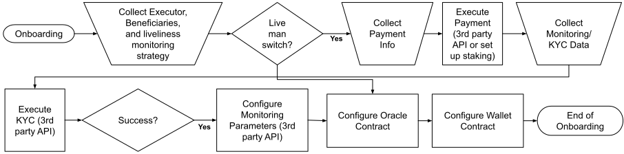

# Alfred Project Plan
Version ?.?-Beta

The first version of Alfred demonstrates the minimum viable product to gain feedback, show to potential investors, and start early marketing efforts toward potential clients and key influencers. Our goal is to develop and promote protocols that make it safer to self-custody digital assets. With our cryptocurrnecy inheritance solution, we aim to develop a user base who cares about security and may be interested in purchasing premium services.

## Features
The release offers a simplified product experience that allows users to:

- Create or sync wallets using our web application
- Deposit and manage funds in an Alfred wallet
- Define beneficiaries and executors 
- Set up liveliness monitoring method and parameters
- Issue test requests to simulate the inheritance process
- Integration of the inhertance functionality as a Gnosis Safe app

## Other goals
- Refine the product and pricing strategies
- Refine the marketing and messaging about the product

## The workflow of Alfred

